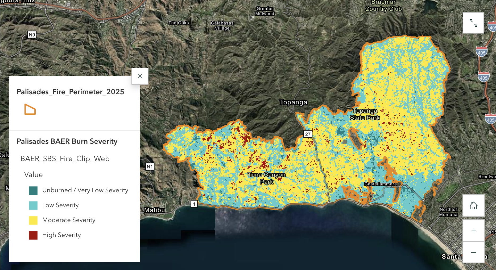

# Palisades Wildfire Impact and Vegetation Recovery

Geospatial and statistical analysis of vegetation response following the 2025 Palisades Fire in Los Angeles County, California.

## Overview

This project evaluates post-fire vegetation change using satellite-derived NDVI, BAER burn-severity data, and National Land Cover Database (NLCD) land-cover information.

The analysis examines whether vegetation response differs among burn-severity classes and whether those changes exhibit spatial clustering.

## StoryMap

[View the full ArcGIS StoryMap](https://storymaps.arcgis.com/stories/46de322b755448eb80eb582f3ea8b4ee)

### Burn Severity



### NDVI Change by Burn Severity


## Workflow

**Remote sensing + GIS → ArcGIS Pro/ArcPy → structured pixel-level dataset → Python statistical analysis → visualization and interpretation**

The spatial processing and data preparation were performed in ArcGIS Pro. A Jupyter notebook was then used for statistical analysis of the resulting pixel-level dataset.

## Analysis

The analysis includes:

- Pixel-level NDVI change analysis
- Descriptive statistics by burn severity
- Kruskal–Wallis tests comparing NDVI change among burn-severity classes
- Epsilon-squared effect sizes
- Within-vegetation comparisons for dominant NLCD classes
- Global Moran's I to evaluate spatial autocorrelation of NDVI change

The statistical analysis uses Python libraries including pandas, NumPy, and SciPy, with ArcPy used to access the ArcGIS project and perform the spatial autocorrelation analysis.

## Data

Primary datasets include:

- Burned Area Emergency Response (BAER) burn-severity data
- NASA Harmonized Landsat and Sentinel-2 (HLS) imagery and derived NDVI
- National Land Cover Database (NLCD) land-cover data

Raw datasets and ArcGIS geodatabases are not included in this repository because of their size and because the source datasets are publicly available from their respective providers.

## Results

The study area covered approximately 23,991 acres.

The analysis identified a statistically significant difference in NDVI change among burn-severity classes and evidence of spatial clustering in NDVI-change values.

Detailed maps, visualizations, and interpretation are presented in the accompanying ArcGIS StoryMap.

## Repository Contents

```text
Palisades-Wildfire-Analysis/
├── README.md
├── notebooks/
│   └── Wildfire_Statistical_Analysis.ipynb
└── .gitignore
